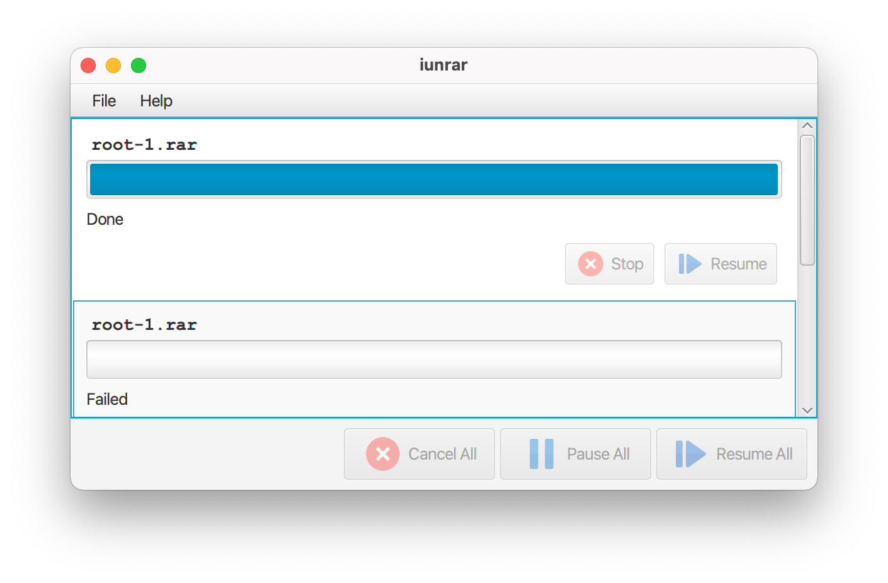
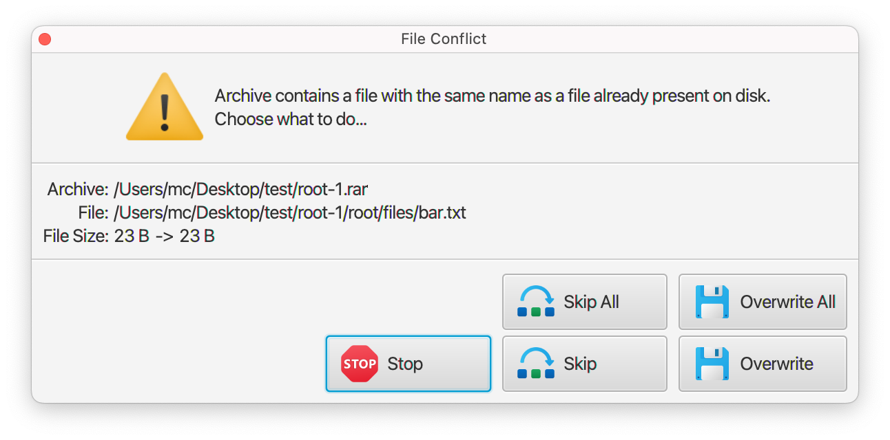

# iunrar

iunrar (read "I unrar") is a simple macOS application that unpacks RAR files.





The application is a tin wrapper around [junrar library](https://github.com/junrar/junrar).

WARNING: It does not support RAR5 format yet.

## Installing

Remember to clear application quarantine bits after installing the app
from GitHub releases.
```
$ cd /Applications
$ sudo xattr -cr iunrar.app
$ open iunrar.app
```

## How to build application from sources

You need JDK 16 or newer to compile and run this application.
```
# This will add module-info to dependencies that are not fully
# JPMS compliant, like e.g. Guava.
./build-modularized-version-of-dependencies.sh

./mvnw clean package
./mvnw javafx:run -pl gui
```

To create a macOS application package:
```
./mvnw clean install -P mkinstaller
```
